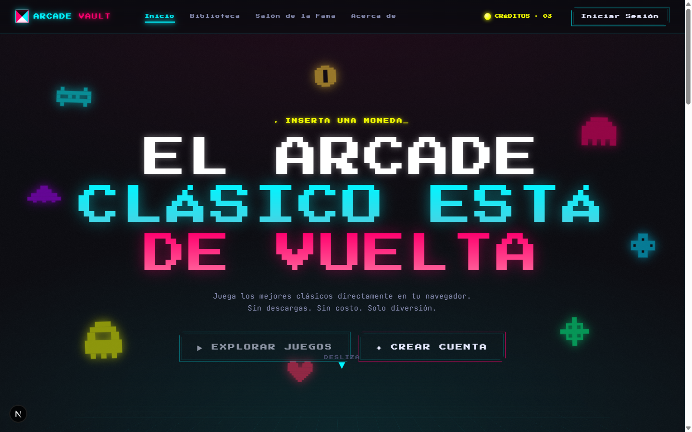
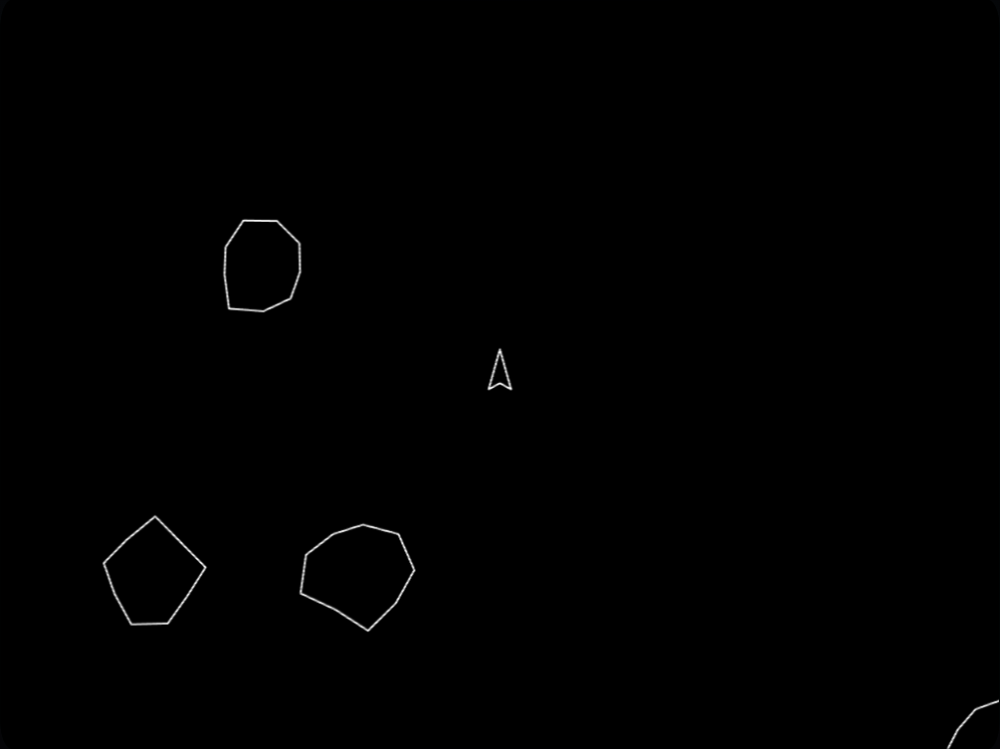
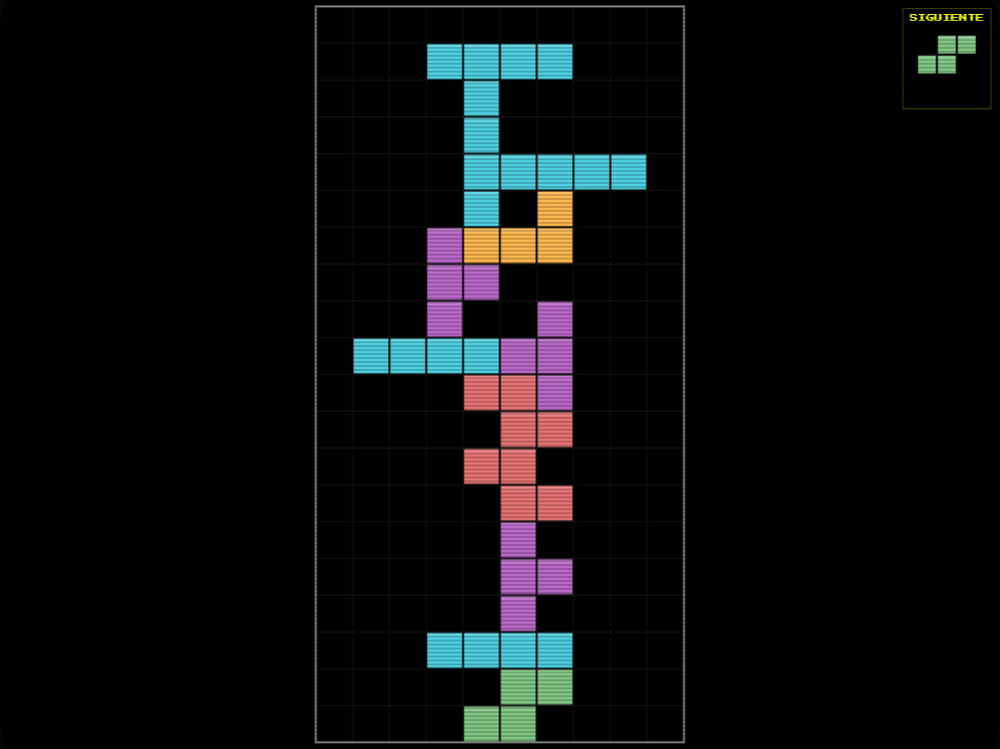
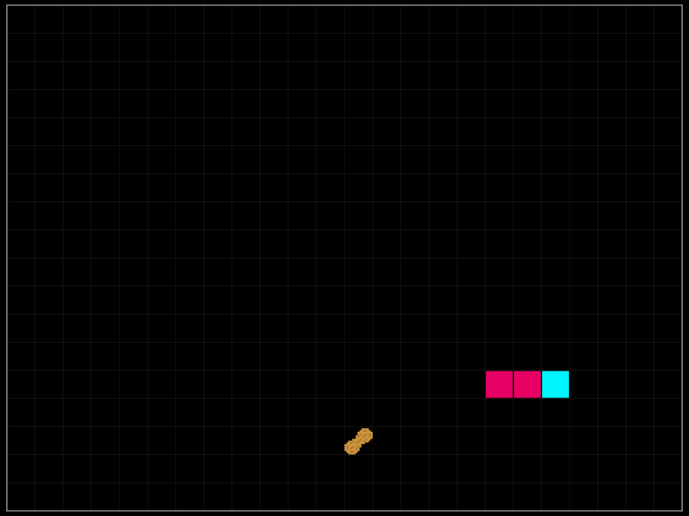
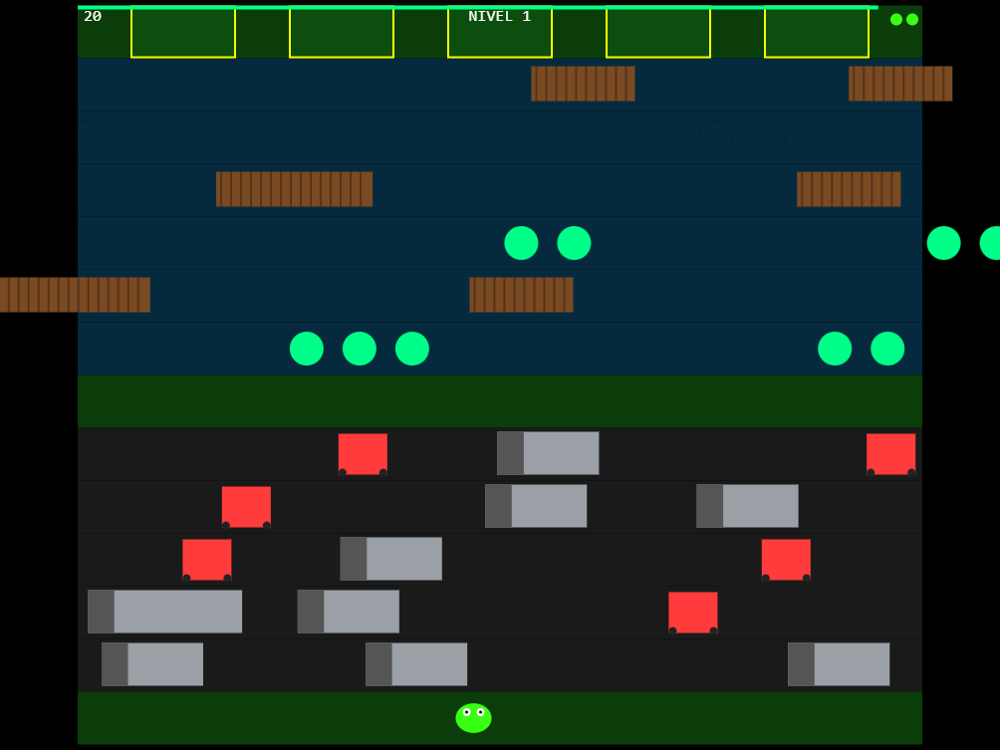
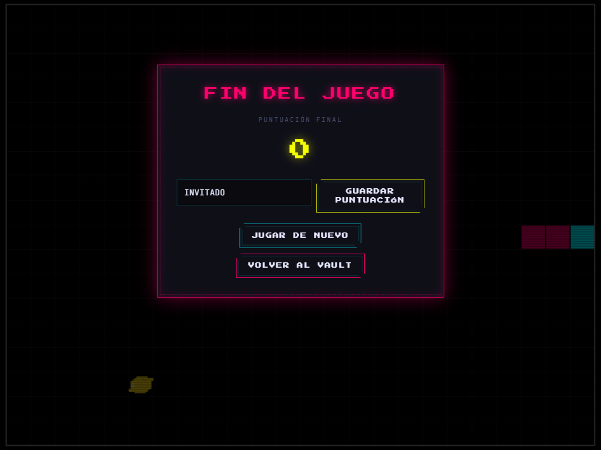
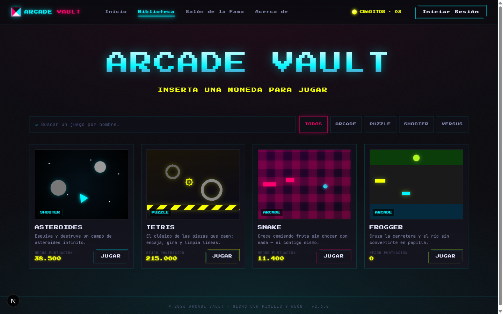
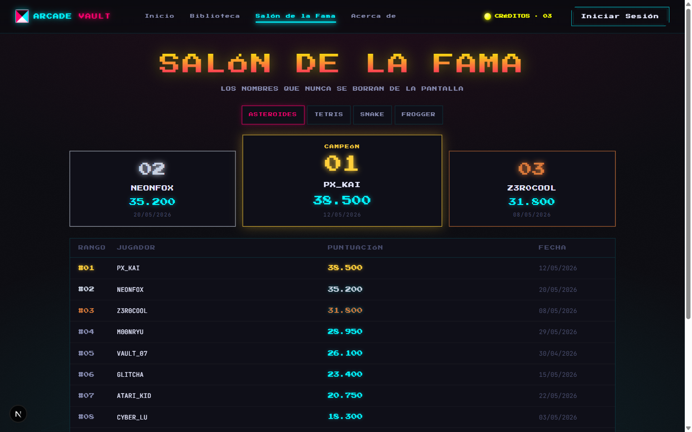

# Arcade Vault

Plataforma web para jugar arcade online y competir por la mayor puntuación.



> Construido con **Spec Driven Design**: ninguna feature se implementa sin un spec
> aprobado antes. Ver [Cómo se construyó esto](#cómo-se-construyó-esto).

## Stack

- **Next.js 16.2** (App Router, Turbopack) + **React 19.2** + **TypeScript 5**
- **Tailwind CSS v4** (vía PostCSS, sin archivo de config)
- **Supabase** — catálogo de juegos, leaderboards y autenticación (`@supabase/ssr`)
- **Resend** — envío del formulario de contacto

## Comandos

```bash
npm run dev       # servidor de desarrollo (Turbopack)
npm run build     # build de producción (NO ejecuta lint)
npm run start     # servidor de producción
npm run lint      # ESLint vía CLI (next lint ya no existe)
```

No hay test runner configurado.

## Variables de entorno (`.env.local`)

```bash
NEXT_PUBLIC_SUPABASE_URL=
NEXT_PUBLIC_SUPABASE_ANON_KEY=
RESEND_API_KEY=
CONTACT_EMAIL_TO=
```

## Rutas

| Ruta                    | Descripción                                 |
| ----------------------- | ------------------------------------------- |
| `/`                     | Home / landing del catálogo                 |
| `/biblioteca`           | Biblioteca completa de juegos               |
| `/juego/[id]`           | Detalle del juego + leaderboard             |
| `/juego/[id]/jugar`     | Reproductor del juego (`GamePlayer`)        |
| `/salon-fama`           | Salón de la fama global                     |
| `/about`                | Sobre el proyecto + formulario de contacto  |
| `/login`                | Registro / inicio de sesión (Supabase Auth) |
| `/login/reset-password` | Fijar nueva contraseña                      |
| `/auth/callback`        | Callback de OAuth y confirmación de email   |
| `/api/contact`          | POST del formulario de contacto (Resend)    |

## Juegos

Cuatro motores canvas/JS escritos desde cero, sin librería de juegos.

| Asteroides | Tetris |
| ---------- | ------ |
|  |  |

| Snake | Frogger |
| ----- | ------- |
|  |  |

El catálogo vive en la tabla `games` de Supabase — ver [`JUEGOS.md`](JUEGOS.md).
En dispositivos táctiles se renderizan controles en pantalla (`TouchControls`).

Al terminar una partida se puede guardar la puntuación en el leaderboard real:



### Biblioteca y Salón de la Fama





## Estructura

```
app/            rutas (App Router) + components/ (Nav, GameCard, GamePlayer, games/)
lib/            data.ts (tipos + mocks), games.ts, leaderboard.ts, useIsTouchDevice.ts
utils/supabase/ factories de cliente SSR (client, server, middleware)
proxy.ts        refresca la sesión SSR en cada request (Next 16: reemplaza middleware.ts)
specs/          specs numerados + agent-jam/ (specs autónomos del agente game-jam)
references/     material de partida (no versionado: esta en .gitignore)
```

## Cómo se construyó esto

Este repo es tanto una plataforma de juegos como una demostración de un método de
trabajo: **Spec Driven Design con agentes de IA**. Nada se implementa sin un spec
aprobado antes.

### El ciclo

```
idea → /spec → revisión humana → specs/NN-nombre.md → /spec-impl → rama + PR → merge
```

1. **`/spec`** abre una fase deliberadamente lenta de definición: pregunta hasta que
   el alcance está cerrado y construye el documento sección por sección. No escribe
   código. La premisa es que *un spec vago se paga después en código improvisado*.
2. **Revisión humana.** El spec se aprueba (`Estado: Aprobado`) antes de tocar nada.
   Aquí es donde se corrige el rumbo barato.
3. **`/spec-impl`** ejecuta el spec ya cerrado. La fase rápida: el contrato ya existe,
   el agente no improvisa alcance.
4. **Una rama y un PR por spec.** El historial de git es la trazabilidad: cada feature
   se puede leer desde su spec hasta su merge.

### Las piezas (`.claude/`)

| Pieza                          | Rol                                                              |
| ------------------------------ | ---------------------------------------------------------------- |
| `skills/spec` + `spec-game`    | Diseñan el spec (genérico / específico de un juego). No codifican. |
| `skills/spec-impl` + `-game`   | Implementan un spec ya aprobado.                                  |
| `agents/`                      | Cuatro agentes especializados (tabla abajo).                      |
| `hooks/format-file.mjs`        | Hook `PostToolUse`: pasa Prettier + ESLint `--fix` a cada archivo que el agente escribe. |
| `CLAUDE.md` / `AGENTS.md`      | Memoria del proyecto: convenciones, stack, rutas y las trampas de Next.js 16 que un modelo no tiene en su entrenamiento. |

`AGENTS.md` existe por un motivo concreto: Next.js 16 trae cambios que rompen respecto
a lo que los modelos "saben" (Turbopack por defecto, `next lint` eliminado,
`middleware.ts` → `proxy.ts`). El archivo obliga a leer `node_modules/next/dist/docs/`
antes de escribir código en vez de confiar en la memoria del modelo.

### Los agentes (`.claude/agents/`)

| Agente           | Qué hace                                                                                                                              | Escribe en                                   |
| ---------------- | ------------------------------------------------------------------------------------------------------------------------------------- | -------------------------------------------- |
| `game-planner`   | Estratega de producto: analiza huecos del catálogo y propone/decide el próximo juego con justificación (categoría, color, viabilidad). No escribe specs ni código. | `game-suggestions.md`                        |
| `game-jam`       | Dado un **tema**, diseña un juego de forma autónoma y entrega ≥2 specs completos (motor jugable + leaderboard real) listos para `/spec-impl`. Nunca escribe código. | `specs/agent-jam/<game-id>/`                 |
| `mobile-porter`  | Cablea los controles táctiles (spec 09) de **un** juego añadiendo su config `<JUEGO>_TOUCH`. No toca el motor del juego, `TouchControls.tsx` ni `useIsTouchDevice.ts`. | `app/components/GamePlayer.tsx`              |
| `skin-designer`  | Aplica los 3 skins canónicos (`classic`, `retro`, `neon`) a **un** juego siguiendo el patrón de `TetrisGame`. Exige juego objetivo explícito.  | `app/components/games/<Juego>.tsx`           |

Cada agente tiene un alcance recortado a propósito: `mobile-porter` y `skin-designer`
trabajan **un juego por invocación** y tienen prohibido tocar archivos fuera de su
competencia. Es la diferencia entre un agente que se puede revisar y uno que hay que
deshacer.

### Un caso: Frogger, diseñado por un agente

Frogger no lo diseñó una persona. Se le dio un tema al agente `game-jam` y este,
en una sola pasada y sin diálogo:

1. Leyó el catálogo existente para no repetir categoría ni mecánica.
2. Decidió el juego y escribió el spec completo —
   [`specs/agent-jam/frogger/frogger.md`](specs/agent-jam/frogger/frogger.md):
   rejilla de 16×14, zonas de carretera y río, tortugas que se sumergen, sistema de
   vidas, tabla de puntuación y el contrato de props con `GamePlayer`.
3. Se revisó y aprobó el spec.
4. `/spec-impl` lo construyó en la rama `spec-agent-jam-frogger` → [PR #14](https://github.com/frankda94/05-arcade-vault/pull/14).

El punto no es que la IA escribiera el código. Es que **el diseño quedó escrito,
revisable y discutible antes de existir una sola línea**.

### Los specs

Cada uno lleva estado, dependencias y fecha. La UI y los specs están en español.

| Spec | Qué resolvió | Estado |
| ---- | ------------ | ------ |
| [01 · Pantallas visuales](specs/01-pantallas-visuales.md) | Portar las 5 pantallas de la plantilla a rutas reales de Next.js | Implementado |
| [04 · About y contacto](specs/04-about-contacto-resend.md) | Página `/about` y formulario de contacto por email con Resend | Implementado |
| [05 · Asteroides](specs/05-asteroides.md) | Primer motor jugable en canvas dentro de un componente React | Implementado |
| [06 · Leaderboard real](specs/06-leaderboard-asteroides-supabase.md) | Tablas `games` y `scores` en Supabase; fin de las puntuaciones falsas | Implementado |
| [07 · Tetris](specs/07-engranajes.md) | Segundo motor + el patrón de props que comparten todos los juegos | Implementado |
| [08 · Snake](specs/08-snake.md) | Tercer motor y el catálogo de juegos movido a Supabase | Implementado |
| [09 · Controles táctiles](specs/09-controles-tactiles.md) | D-pad en pantalla para jugar desde el móvil | Implementado |
| [10 · Autenticación](specs/10-autenticacion.md) | Supabase Auth real: registro, login, OAuth y sesión SSR | Implementado |
| [11 · Seguridad](specs/11-seguridad.md) | RLS, restricciones de contraseña y security headers HTTP | Implementado |

Escritos por el agente `game-jam`, no por una persona:

| Spec | Qué es | Estado |
| ---- | ------ | ------ |
| [Frogger](specs/agent-jam/frogger/frogger.md) | Motor completo diseñado desde un tema, sin diálogo | Implementado |
| [Conexión](specs/agent-jam/conexion/) | Puzzle de conexión, motor + leaderboard | Borrador, sin implementar |

> No existen los specs 02 y 03: la numeración saltó y nunca se escribieron.

## Seguridad

Spec [`11-seguridad`](specs/11-seguridad.md) aplica RLS en `games`/`scores`, restricciones
de contraseña en Supabase Auth y security headers en `next.config.ts`.
**Pendiente:** no hay Content-Security-Policy (fuera de alcance del spec 11).
